I have been modding the legendary Half-Life 1 for these years, and somehow quite spontaneously I thought: 
how cool it would be to be able to compile maps on some platform other than the usual x86 and amd64... 
Then I remembered that I have an Android TV box at home that, in theory, could be used for this purpose. 
So, why not? This is how all this things was started.

# What's we have?
In stock, I had a budget GoldMaster I-905 TV set-top box, which was completely unremarkable. 
It has 16 gigabytes of internal memory, 2 gigabytes of RAM. Based on the Allwinner H313 processor. 
From interfaces: has two USB 2.0 ports, composite video output, HDMI port. 
Network access can be provided both via Wi-Fi and via an Ethernet port (I used a wired connection).

| 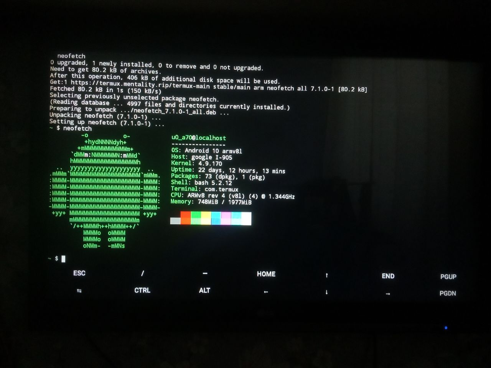 | 
|:--:| 
| *Main information about TV-box system, shown by neofetch* |

Also, we need map compiler sources. For almost 30 years of the existence of the game, quite a few of their 
variations have appeared: the original compilers from Valve, ZHLT, VHLT, P2ST, etc. I will use the map compilers 
from my PrimeXT project: they are the most up-to-date at the moment, they will be the easiest to assemble and run 
under some exotic platform, unlike all other variations. The game itself, as well as all related utilities, 
including map compilers, are written in C/C++. PrimeXT uses the CMake build system.

# Preparing
After a short search for information, I found out that in order to build C++ projects straight on Android, I need [Termux](https://termux.dev/en/). 
It needs to be downloaded from the [F-Droid repository](https://f-droid.org/ru/packages/com.termux/) as the version 
published on Google Play [has been deprecated](https://www.reddit.com/r/termux/comments/pkujfa/important_deprecation_notice_for_google_play/) and is no longer supported.  
  
After installing Termux, just in case, update the installed packages:
```
pkg upgrade
```

Now let's install the packages that we actually need.
```
pkg install cmake git openssh
```
    
For more convenient work, I decided to run an SSH server on the TV-box and connect to it from my computer. 
To do this, I used a bunch of software KiTTY + WinSCP. Of course, you can use any other software instead. 
And you can do without an SSH server at all - just write all the necessary commands into Termux manually on the device. 
I will use WinSCP for convenient work with files on a remote device.  
  
Now you need to start the SSH server: the procedure is quite trivial.  
First, we need to set a password to connect to the server, and then start the corresponding service.
```
passwd
sshd
```

After that, you can try to connect from the computer to the server. Please note that Termux uses port **8022** for the 
SSH server, not the usual 22. You can enter any username, but you need to enter the password 
specified earlier. If the connection is successful, a shell will be displayed.

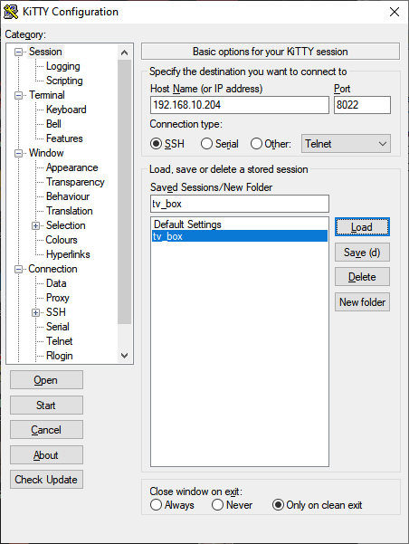
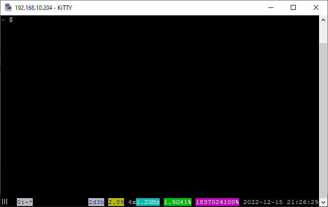

# Building map compilers
After completing all the preparatory procedures, you can go directly to the build procedure: the first step is to clone the sources into your home directory.
```
cd ~
git clone --recursive https://github.com/SNMetamorph/PrimeXT.git
cd PrimeXT
```

Then, you need to create and prepare the directory in which the assembly will take place.
```
cmake -E make_directory ./build
cd build
```

And now it's time to generate the CMake cache and run the build. Since I'm only interested in map compilers, 
I disabled building game libraries, the launcher, and other utilities. Also, to make the compilation of the project faster, I will set the build to 4 threads.
```
cmake .. -DBUILD_CLIENT=OFF -DBUILD_SERVER=OFF -DENABLE_PHYSX=OFF -DBUILD_GAME_LAUNCHER=OFF -DBUILD_PXMV=OFF -DBUILD_PXSV=OFF -DENABLE_STATIC_LINKING=OFF -DCMAKE_BUILD_TYPE=Release
cmake --build . --config Release --parallel 4
```

| 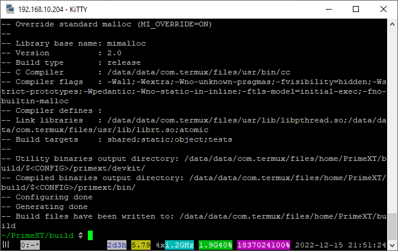 | 
|:--:| 
| *CMake cache was successfully generated* |

After executing the two commands described above, the build process will start.
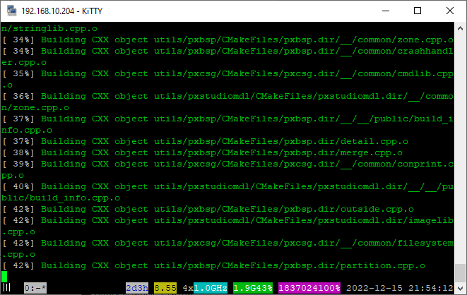

If the build succeeds, it will look like this. If any errors occur, it is better to restart the assembly 
in one thread, so it will be easier to find out exactly where the compilation error occurred. By the way, 
on this set-top box, the assembly into 4 streams took about four minutes, taking into account the 
fact that an IPTV player was running in the background.

| 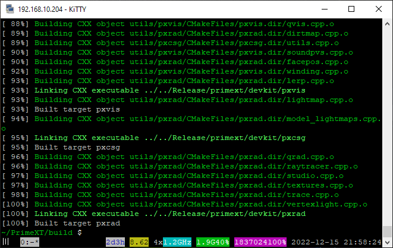 | 
|:--:| 
| *Map compilers build successfully finished* |

# Compiling map
For the final step, you need to prepare a working directory that will contain 
WAD files with textures, a *.rad* file, and a map source. In my case, this directory will be called **gameres**.
```
mkdir ~/gameres
cd ~/gameres
```

Then, inside this directory, you need to create a **gameinfo.txt** file with the following content:
```
basedir ""
gamedir "gameres"
```

Important tip: in this file, the value of the *gamedir* parameter must match the name of the working directory. 
Next, you need to put the WAD files used in the working directory, create a subdirectory called maps inside it, 
and put the *.rad* file and the map source in the form of a *.map* file into the subdirectory. 
All the necessary files that I used are available at [this link](/crossfire_mirror_sources.7z).  
  
Now you can try to compile the map, and all that remains is to wait.
```
cd ~/PrimeXT/build/Release/primext/devkit
./pxcsg ~/gameres/maps/crossfire_double1_v2.map
./pxbsp ~/gameres/maps/crossfire_double1_v2.bsp
./pxvis ~/gameres/maps/crossfire_double1_v2.bsp
./pxrad ~/gameres/maps/crossfire_double1_v2.bsp
```

The map compilation process consists of four steps. At the end of each stage, the time spent on it will be displayed. 
If there are any problems during the compilation of the map, you can look at the log file in the maps subdirectory. 
Also, you can add the -dev 5 startup option to compilers to display the process in more detail.

| 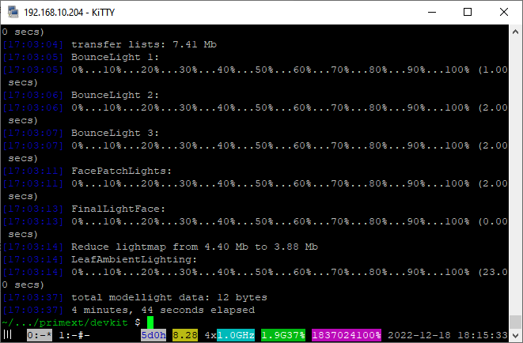 | 
|:--:| 
| *Last map compiling stage was finished* |

# Checking the results
After the map successfully compiled on the TV-box, I decided to rebuild the same map on my computer 
and then compare these two maps. Ideally, there should be no visible differences. I will test this whole thing 
in the PrimeXT mod, which is based on the Xash3D FWGS engine.

| 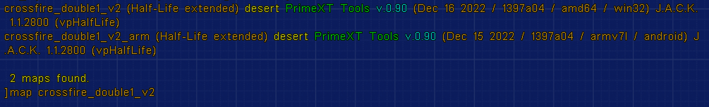 | 
|:--:| 
| *Maps build on different architecture and platform* |

The engine has a `mapstats` console command that allows you to display various 
internal information about the map. For our situation, this is exactly what we need.
  
## Stats of map compiled on TV-box
```
Object names  Objects/Maxobjs  Memory / Maxmem  Fullness
------------  ---------------  ---------------  --------
entities         [variable]       64780/1048576   ( 6.2%) 
planes           2179/65536       43580/1310720   ( 3.3%) 
textures         [variable]        4976/33554432  ( 0.0%) 
vertexes        11219/65535      134628/786420    (17.1%) 
visibility       [variable]      199238/16777216  ( 1.2%) 
nodes            5031/32767      120744/786408    (15.4%) 
texinfo          1383/65535       55320/2621400   ( 2.1%) 
faces            8467/65535      169340/1310700   (12.9%) 
lightmaps        [variable]     1745778/33554432  ( 5.2%) 
clipnodes       12686/32767      101488/262136    (38.7%) 
leafs            3260/32767       91280/917476    ( 9.9%) 
markfaces       11552/65535       23104/131070    (17.6%) 
edges           20150/1048576     80600/4194304   ( 1.9%) 
surfedges       40037/2097152    160148/8388608   ( 1.9%) 
models            142/1024         9088/65536     (13.9%) 
deluxmaps        [variable]     1745778/33554432  ( 5.2%) 
=== Total BSP file data space used: 4.53 Mb ===
World size ( 5120 5824 3920 ) units
Supports transparency world water: No
Lighting: colored
World total leafs: 2318
original name: maps/crossfire_double1_v2_arm.bsp
internal name: desert
map compiler: PrimeXT Tools v.0.90 (Dec 15 2022 / 1397a04 / armv7l / android)
map editor: J.A.C.K. 1.1.2800 (vpHalfLife)
```

## Stats of map compiled on my PC
```
Object names  Objects/Maxobjs  Memory / Maxmem  Fullness
------------  ---------------  ---------------  --------
entities         [variable]       64777/1048576   ( 6.2%) 
planes           2179/65536       43580/1310720   ( 3.3%) 
textures         [variable]        4976/33554432  ( 0.0%) 
vertexes        11210/65535      134520/786420    (17.1%) 
visibility       [variable]      198643/16777216  ( 1.2%) 
nodes            5031/32767      120744/786408    (15.4%) 
texinfo          1383/65535       55320/2621400   ( 2.1%) 
faces            8465/65535      169300/1310700   (12.9%) 
lightmaps        [variable]     1744599/33554432  ( 5.2%) 
clipnodes       12747/32767      101976/262136    (38.9%) 
leafs            3258/32767       91224/917476    ( 9.9%) 
markfaces       11512/65535       23024/131070    (17.6%) 
edges           20138/1048576     80552/4194304   ( 1.9%) 
surfedges       40013/2097152    160052/8388608   ( 1.9%) 
models            142/1024         9088/65536     (13.9%) 
deluxmaps        [variable]     1744599/33554432  ( 5.2%) 
=== Total BSP file data space used: 4.53 Mb ===
World size ( 5120 5824 3920 ) units
Supports transparency world water: No
Lighting: colored
World total leafs: 2316
original name: maps/crossfire_double1_v2.bsp
internal name: desert
map compiler: PrimeXT Tools v.0.90 (Dec 16 2022 / 1397a04 / amd64 / win32)
map editor: J.A.C.K. 1.1.2800 (vpHalfLife)
```

As you can see, there are still minimal differences in stats. It is difficult to say what exactly is the reason for 
these differences, but most likely they are completely uncritical. 
Next, it makes sense to compare if there are any visual differences on the map itself.

## Screenshots of map compiled on my PC
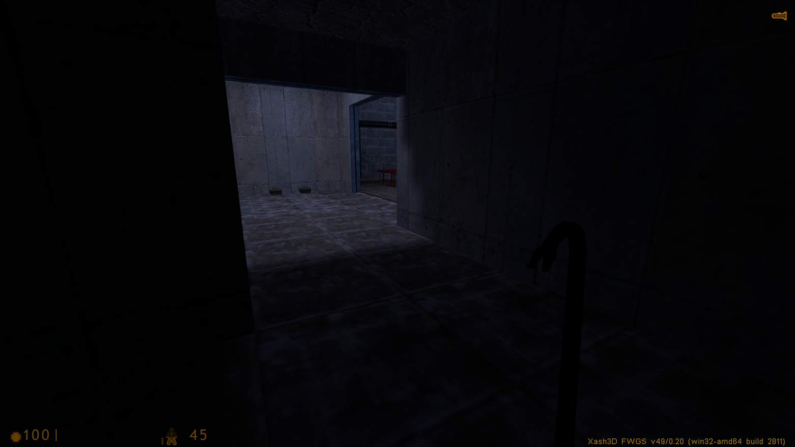
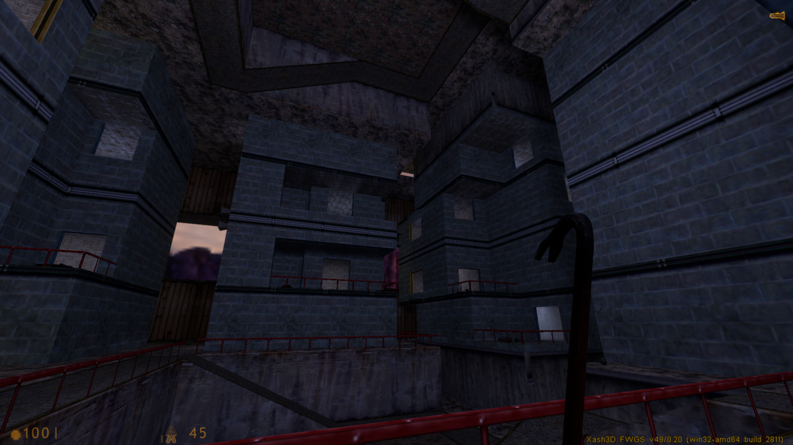
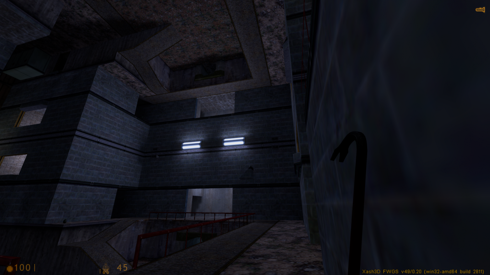
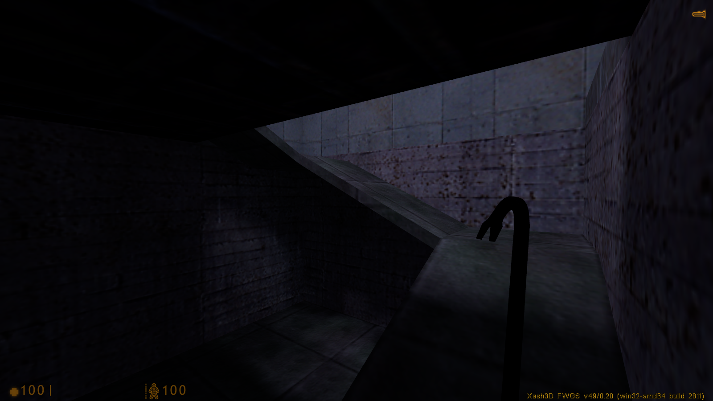

## Screenshots of map compiled on TV-box
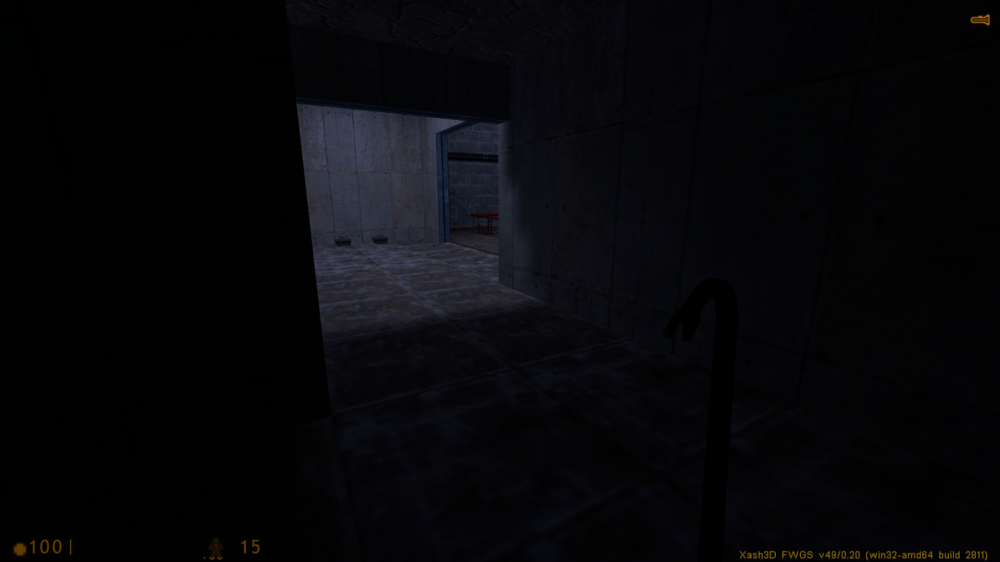

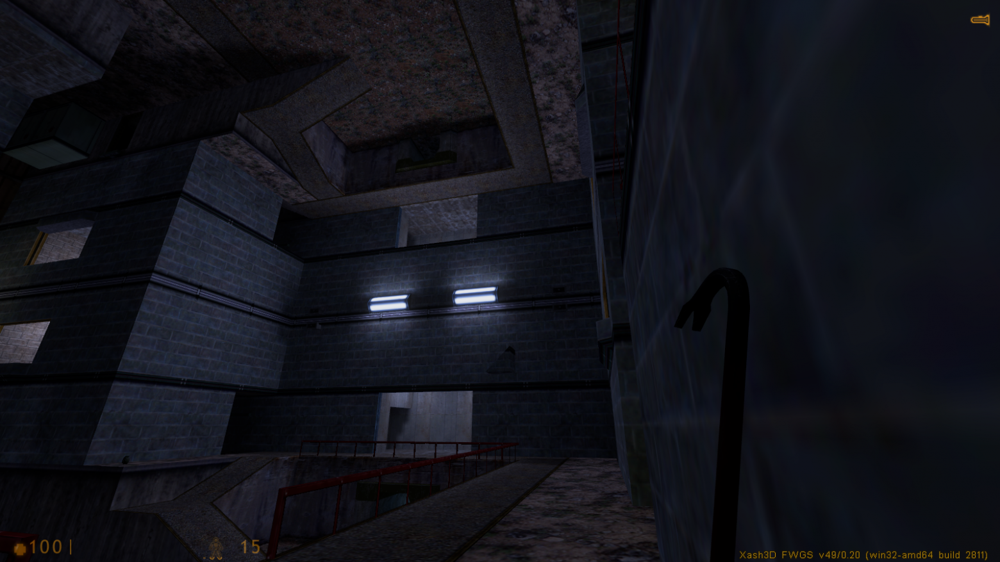
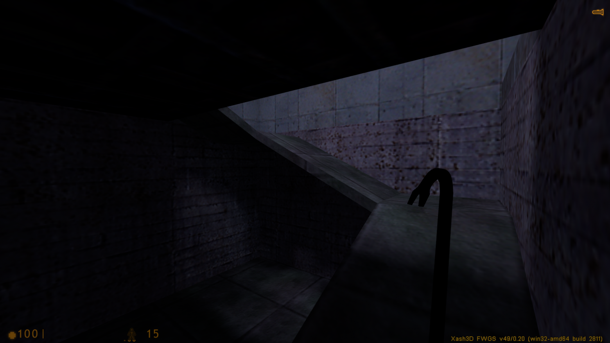

Personally, I didn’t notice any visual differences in lighting or geometry at all, which of course is good. 
The experiment can be considered successful.

# Resume
Using the procedures described above, it is quite possible to compile maps for Half-Life 1 on almost any device that 
is based on the Android or Linux OS. Unless, on too large and detailed maps, the device may not have enough RAM 
for compilation. Can all this be useful to someone? Of course. For example, if for some reason you don’t want 
to load the main PC, or there are no devices other than a smartphone at all, but the map needs to be compiled somehow.
