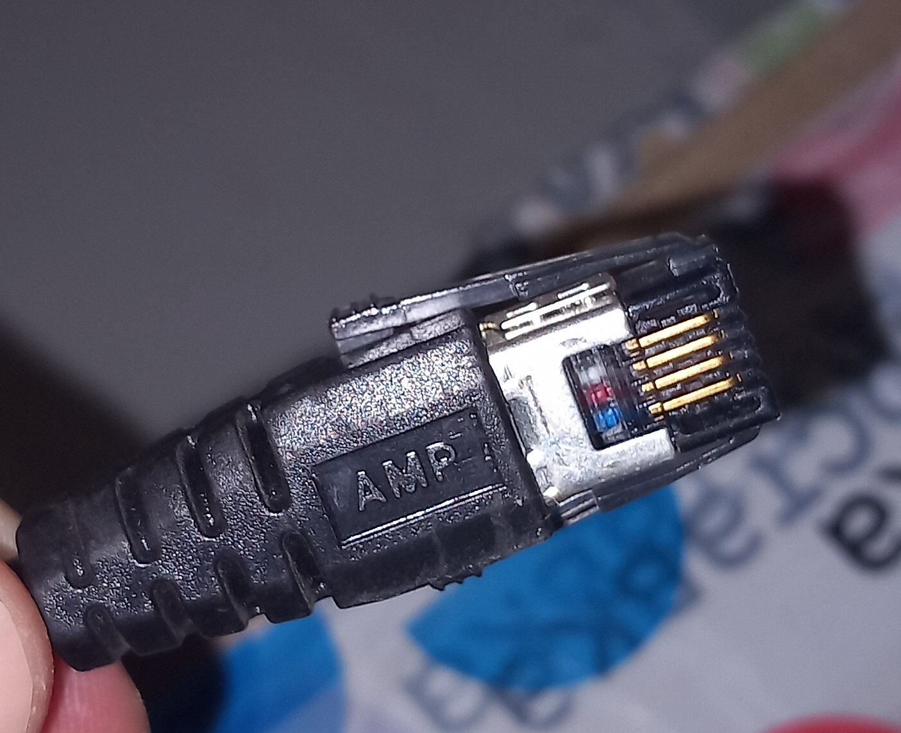
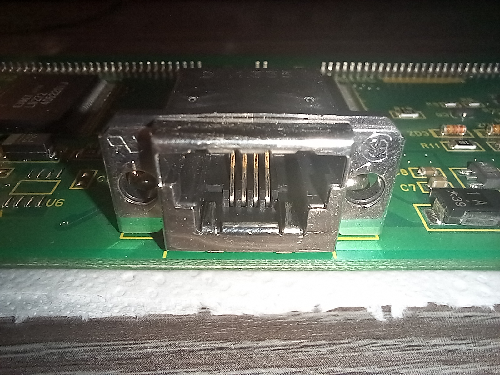
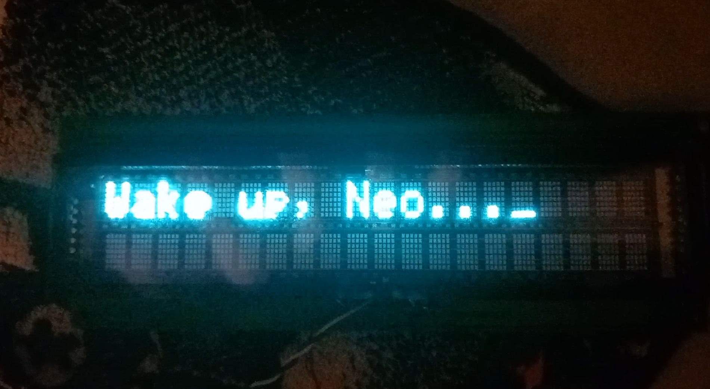
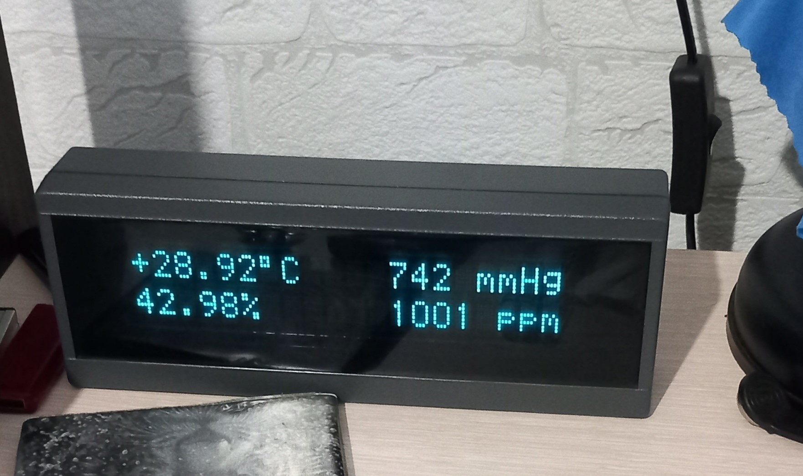

## Introduction
Recently I found such an interesting and kind of vintage piece of hardware at local store - vacuum-fluorescent display (VFD) with 2x20 characters. So I decided to buy two of them for future investigations since they're relatively cheap.

Originally, display distributed with pole and cable. I got rid of pole since I don't need it, anyway you can find how it looks without any problems. About cable: it has familiar DB9 male connector on one side, but on other side there is some strange connector that vaguely looks like 8P8C, but I've never seen it before anywhere. 

:::warning
Note that althrough DB9 connector is used, display is not compatible with common serial port, don't try to plug it in PC, it won't work and can even damage your port.
:::

|  | 
|:--:| 
| *Proprietary connector on display cable* |

This is how display without pole looks like:


## Dismantling the display
Let's try to detach front panel: that can be done with bare hands, you just need to pull front panel both down and away from the display. 
:::tip
Front panel has dimming filter in it, and it is not glued or welded and can be easily pulled away, in case if you want to polish or clean this filter.
:::

This is how front panel looks like on the back side:


Next, you need to remove three screws on both sides:


|  | 
|:--:| 
| *Display case without PCB, it has a lot of free space, even when PCB attached* |

|  | 
|:--:| 
| *PCB extracted from display case* |

First thing we see, is that display based on Futaba M202MD10C board. From this information I found out that display more likely uses
UART with 9600-8N1 configuration (but also with inverted logic levels). So I'll test it in future steps. Also it's worth to notice that if you'll try to gather information about this board, you'll find much more than it was when I was doing all this research (reason will be described in the end of this post).

## Determining pinout
But let's assume that we're at time point when all of needed information is not available yet. Next step we should do is determine display pinout. Probably, since display has only four pins, it shouldn't be that hard. I easily found GND pin and two VCC pins (that is so strange that we have 2 pins for VCC, but only 1 for ground). Therefore, last remaining pin is used for transfer data from microcontroller to display. As a result, we got this table:



| Pin number | Description |
|------------|-------------|
| 1          | GND         |
| 2          | DATA        |
| 3          | VCC         |
| 4          | VCC         |

We got pinout scheme and obviously next step will be applying voltage to display. But what exact voltage we should use? I guess that 5 Volts will not enough. Then I'll try 9 and 12 Volts. As it turned out later, 9 Volts also not enough. But with 12 Volts it worked - display showed underscore at first row. 

## Connecting display to MCU
And it's time to bring other hardware to this journey - I'll use Arduino Uno and try to send some information to display and check what will happen. For this we need pretty simple code snippet:

```c++
#include <Arduino.h>
#include <SoftwareSerial.h>

// display DATA should be connected to pin #3, pin #2 will be unused
// "true" as third argument means that logic levels will be inverted
SoftwareSerial softSerial(2, 3, true);

void setup() {
    // sets proper baudrate according to information obtained earlier
    softSerial.begin(9600);

    // send some ASCII text to check is it even works
    softSerial.print("Wake up, Neo...");
}

void loop() {
}
```

And it worked without any problems!



## Conclusion
This post in theory can be much longer, I didn't covered determining other functions of display protocol, such as controlling cursor position, dimming, etc. But there is nothing interesting it in, really. It's just sending random bytes to serial stream and see what happened. For narrow down the number of possible bytes combinations I checked datasheets for similar displays from Futaba corporation. Also, some russian guy with nickname `abomin` helps me with code pages and custom character defining feature a lot. And one by one, I determined all things that this display can do. 

And result of all this investigations was [library for working with Futaba M202MD10C board on Arduino framework](https://www.arduinolibraries.info/libraries/futaba-vfd-m202-md10-c). This library exposes in it's API all possible functionality of displays based on this board. Library is well documented and contains bunch of code examples that covers different library functions. Therefore, there is no problems at all to create your own library that works with this display, in case if you want to use display with STM microcontrollers or just don't want to depends on any kind of frameworks. 

After some time I got an idea to make thing like meteostation, but based on this display. It shows current air temperature, relative humidity, atmospheric pressure and carbon dioxide concentration on display, and also sends all of that information to Home Assistant through MQTT. That thing based on ESP8266 microcontroller, and sensors BME280 and MH-Z14A used too. Energy consumption of this device is around 6 Watts, a most of this bugdet used by display. This is how this device looks:


