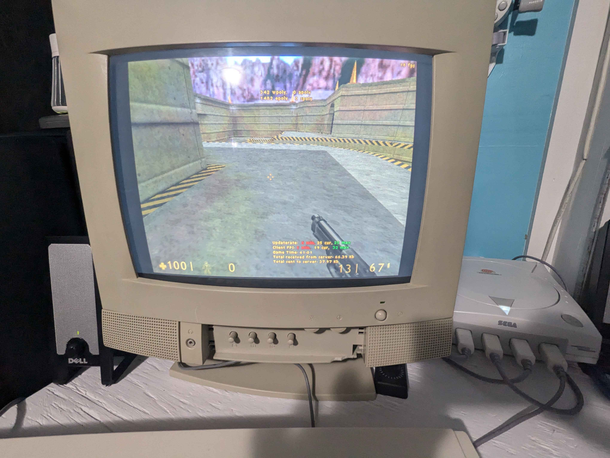

import Image from '@theme/IdealImage';
import ReactPlayer from 'react-player'

# Resume

This is a detailed overview of the changes that were made during the development of Xash3D FWGS engine in the year 2024. I would also recommend checking out the previous development overviews that were 
made for [2022](https://velaron.github.io/xash3d-fwgs-november-2022.html) and [2023](https://velaron.github.io/xash3d-fwgs-november-2023.html) years.

# Consider Donating

- [**a1batross**](https://github.com/a1batross) - initial Xash3D SDL2/Linux port author, Xash3D FWGS engine maintainer, creator of non-commercial Flying With Gauss organization
  - Boosty page: https://boosty.to/a1ba
- [**nekonomicon**](https://github.com/nekonomicon) - maintainer of [hlsdk-portable](https://github.com/FWGS/hlsdk-portable), [mdldec](https://github.com/FWGS/xash3d-fwgs/tree/master/utils/mdldec), [opensource-mods.md](https://github.com/FWGS/xash3d-fwgs/blob/master/Documentation/opensource-mods.md) and Xash3D FWGS [contributor](https://github.com/FWGS/xash3d-fwgs/commits?author=nekonomicon) (*BSD/clang port, PNG support, etc)
  - Boosty page: https://boosty.to/nekonomicon
- [**Velaron**](https://github.com/Velaron) - maintainer of [cs16-client](https://github.com/Velaron/cs16-client) & [tf15-client](<https://github.com/Velaron/tf15-client>) and Xash3D FWGS [contributor](<https://github.com/FWGS/xash3d-fwgs/commits?author=Velaron>) (Android port, voice chat, etc)
  - Buy Me A Coffee page: https://www.buymeacoffee.com/velaron
- [**SNMetamorph**](https://github.com/SNMetamorph) - maintainer of [PrimeXT](https://github.com/SNMetamorph/PrimeXT) & [GoldSrc Monitor](https://github.com/SNMetamorph/goldsrc-monitor) and Xash3D FWGS [contributor](https://github.com/FWGS/xash3d-fwgs/commits?author=SNMetamorph) (Windows port, voice chat, etc)
  - BTC: `16GAzK3qei5AwBW7sggXp3yNcFHBtdpxXj`
  - ETH (ERC20): `0xb580eeca9756e3881f9d6d026e28db28eb72a383`
  - USDT (ERC20): `0xb580eeca9756e3881f9d6d026e28db28eb72a383`
  - USDC (ERC20): `0xb580eeca9756e3881f9d6d026e28db28eb72a383`

## GoldSrc network protocol support
##### by [**a1batross**](https://github.com/a1batross)

Since this autumn, GoldSrc protocol support is in the mainline engine and available for testing for anybody. 
This feature is still a work-in-progress, but anyway it is good enough to be called playable.
We appreciate any bug reports and contributions according to it.

For connecting to GoldSrc-based servers, you can use the console command: `connect <ip> gs`.
Also, GoldSrc servers can be added to the favorites list - just don't forget to choose the proper protocol when adding it.

There is short footage of playing Counter-Strike 1.6 on some GoldSrc-based server.

<ReactPlayer 
  url={require('./vid/goldsrc-proto-test.webm').default} 
  width='100%'
  height='100%'
  controls 
/>

But keep in mind, there are requirement for server to be able to accept connections from Xash3D-based clients: it should use Reunion or Dproto. Without this requirement, you will just get "Steam validation rejected" error on connecting.
That is because proper authorization with Steam API is not implemented in engine yet. There is a list of things that are still unfinished:

* Authorization using Steam API (first priority)
* Voice chat on GoldSrc-based servers
* Player sprays on GoldSrc-based servers

:::tip
To avoid misunderstandings: please note that this feature isn't made to circumvent Valve's DRM. It doesn't make it possible to connect to official Steam-based servers without
having purchased [Half-Life copy](https://steamcommunity.com/app/70) on your Steam account. Piracy is highly illegal and Xash3D FWGS developers always encourage everyone to get Half-Life from the Steam store.
:::

Also, we encountered that some GoldSrc-based servers are recognizing Xash3D clients as "fake clients" and banning/kicking them. 
Maybe this problem will be solved along with better compatibility with GoldSrc behavior, but maybe not - we don't know the logic behind this useless "fake client" check.

## Voice chat improvements
##### by [**SNMetamorph**](https://github.com/SNMetamorph) and [**a1batross**](https://github.com/a1batross)

Fixed an issue when voice chat sound would become completely distorted when multiple players spoke simultaneously.
Also, some settings related to voice chat were added to the multiplayer settings menu. Voice chat button was added 
to touch configuration for Android port.

<Image img={require('./img/vc-settings.jpg')} />

There is short video with demonstration of working voice chat in multiplayer.

<ReactPlayer 
  url={require('./vid/voicechat-test.webm').default}
  width='100%'
  height='100%'
  controls
/>

## Server browser improvements
##### by [**Flying With Gauss**](https://github.com/FWGS)

Added tabs with favorites and recent servers, basic server filtering was added (in the bottom).

<Image img={require('./img/server-browser-1.jpg')} />

Also, an entirely new menu for viewing server detailed information was added.

<Image img={require('./img/server-browser-2.jpg')} />

## Support for Ogg Vorbis and Ogg Opus audio formats
##### by [**SNMetamorph**](https://github.com/SNMetamorph)

We've needed some kind of MP3 alternative for a long time. Since being invented back in 1993, nowadays MP3 is far inferior to its modern alternatives in both compression efficiency and audio quality. At the same time, also the best lossy audio compression codec Opus is open-source and free, and we're already using it for voice chat - why don't use it for audio files too? Also, some of the mods using really a lot of sounds, and at some point audio compression efficiency can save several gigabytes of disk space.

What about Vorbis codec? It's still better than MP3, but from practical point of view it can be useful in terms of backward compatibility with existing content (because, obviously, if you have lossy-compressed audio - it's better to not recompress it to another format, because this will lead to "generation loss"). Ogg Vorbis is pretty wide-spread audio format, also other idTech-based game engines supports it.

The sound looping feature, which was already [supported in MP3](https://github.com/FWGS/xash3d-fwgs/blob/master/Documentation/extensions/mp3-loops.md), now also supported in both these formats too.

:::tip
If you not yet familiar: for Ogg Vorbis sounds file extension `.ogg` is used. For Ogg Opus sounds used `.opus` file extension respectively.
:::

## Video playback support
##### by [**a1batross**](https://github.com/a1batross)

This is from that rare kind of feature, that had already been in the engine for a long time, but could not be used for technical reasons.
Originally, video playback was dependent on the platform-specific "Video For Windows" framework and the ancient Cinepak codec. 
For proper working, it should be installed system-wide and also it's available for use only for 32-bit processes and exclusively for Windows. 
Because of that, users were having a lot of troubles while trying to get things working, and with some circumstances it was not possible at all.

In engine and some of the mods, we support (and use) 64-bit builds for a long time already. Also, we do care about other platforms rather than only Windows.
This is why we decided to completely get rid of VFW-related code and instead use ffmpeg for video playback.
Also, we decided that video playback support should be an optional feature - ffmpeg libraries are bulky; also, most mods don't use videos anyway.
So, anybody who has plans to distribute mods along with the engine, or just want to free up some disk space will be able to just remove those libraries.

Here is a short demonstation of the video playback feature within PrimeXT. The original `valve.avi` intro video was used for it.

<ReactPlayer 
  url={require('./vid/video-playback-test.webm').default}
  width='100%'
  height='100%'
  controls
/>

## Port for Sega Dreamcast (WIP)
##### by [**maximqaxd**](https://github.com/maximqaxd/xash3d-fwgs_dc/) and **megavolt85**

This is still in progress, but it already works on actual hardware. Port can load 
content that was originally made for Dreamcast port, because it supports all of that platform-specific content
formats such as PVR with VQ compression and ADPCM WAV sounds. Multiplayer works too.



<ReactPlayer 
  url='https://www.youtube.com/watch?v=-QVYlEdS6EQ'
  width='100%'
  controls
/>

## MacOS port rehabilitated
##### by [**sofakng**](https://github.com/sofakng)

Project building issues on MacOS were resolved, and automatic builds for MacOS were added to CI. But this port isn't well-tested anyway, and it is possible
to catch some MacOS-specific bugs: in this case, feel free to report it on [GitHub](https://github.com/FWGS/xash3d-fwgs/issues).
But our capabilities with the MacOS port are limited, since nobody from the developers has any relevant hardware, and because of it we're looking for a proper maintainer.

## Compatibility with GoldSrc improved further
##### by [**Flying With Gauss**](https://github.com/FWGS)

There isn't much to describe here, as it involves plenty of minor changes that are hard to track down retrospectively.
In some cases, incompatibility was caused by differences in console variables. Sometimes, it was caused by differences in internal logic between GoldSrc and Xash3D.

- Implemented PHS/PAS generating; this helped to fix [issue #619](https://github.com/FWGS/xash3d-fwgs/issues/619)
- Added `room_off` console variable; after this Sven Co-op 4.8 client started working with Xash3D FWGS
- Added `gl_overbright` from early GoldSrc versions, also some changes with gamma were made for better matching with GoldSrc looking
- Added `gl_fog` console variable for toggling OpenGL's built-in fog implementation. Some of GoldSrc servers anticheats were checking this value
- Added `fps_override` console variable for overriding framerate soft limit
- Reverted ancient GoldSrc shadows, this feature was reintroduced to GoldSrc at the HL25 anniversary update - as of today, we support it too. It could 
be enabled with `r_shadows` console variable
- Fixed broken physics behavior on high FPS: it was caused by rounding error in a physics code

## Complete IPv6 support in multiplayer
##### by [**Flying With Gauss**](https://github.com/FWGS)

As of today, engine and masterserver both support IPv6. And we have some masterservers running on the Internet through IPv6.
This means anybody could set up their Xash3D FWGS server on the Internet with IPv6, and it will be presented for other clients who also have IPv6 address.
Also, it is well tested, and we didn't discover any issues with it. 

If you, for some reason, need to run a dedicated server exclusively on IPv6, you can use the `-noip` startup parameter, which completely disables IPv4 networking.

## Published Docker image of up-to-date XashDS
##### by [**SNMetamorph**](https://github.com/SNMetamorph)

If you have some VDS or PC with an installed Linux distro, now it's possible to set up a Half-Life dedicated server 
based on the up-to-date Xash3D FWGS engine build in a couple of actions! Also, this Docker image has pre-installed Metamod, AMX Mod X, and
bots using jk_botti Metamod plugin.

For now, a pre-built Docker image is only available for Half-Life, but in the future we hope to build images for other mods too (such as Counter-Strike 1.6).

Here is Docker Compose file example. You can read more information at [GitHub repository](https://github.com/FWGS/xashds-docker).

```yaml
services:
  xashds:
    image: snmetamorph/xashds-hldm:latest
    container_name: xashds-hldm
    restart: always
    command: +map crossfire
    ports:
      - '27015:27015/udp'
```

## Hardcoded sounds overriding through sounds.lst
##### by [**a1batross**](https://github.com/a1batross)

This brand new feature can be used to override some of the hardcoded sounds in temp entities and server physics.
You can read a more detailed description in the [documentation](https://github.com/FWGS/xash3d-fwgs/blob/master/Documentation/extensions/sounds.lst.md).

## Support for external textures 
##### by [**a1batross**](https://github.com/a1batross)

This feature allows you to create HD texture packs for classic mods without involving any code changes. 
Initially, this feature was presented in some of the old vanilla Xash3D versions, but was removed by Uncle Mike at some point, and 
now it's back here again. You can read a more detailed description in the [documentation](https://github.com/FWGS/xash3d-fwgs/blob/master/Documentation/hd-textures.md).

## Other minor changes
##### by [**Flying With Gauss**](https://github.com/FWGS)

- Added SIGTERM signal handling for XashDS, it's needed for the graceful shutdown of the dedicated server inside Docker container
- Enabled engine binaries signing for the Windows platform, this helped a lot with false-positive antivirus detections
- Added console variable `cl_logomaxdim` for setting maximal dimension for player sprays, default is 96 units
- Added more information to logs: engine build number, VCS branch name & commit hash, platform and architecture name, game startup parameters
- FastDL improvements: support for chunked transfer encoding and gzip compression
- Android port improvements: some platform-specific bugs were fixed
- Reduced connection time to the servers: for now, you can connect to the server in less than 5 seconds (except time spent on content downloading, if it was required)
- Entities state interpolation fixes: leaded to much more smooth and better multiplayer experience
