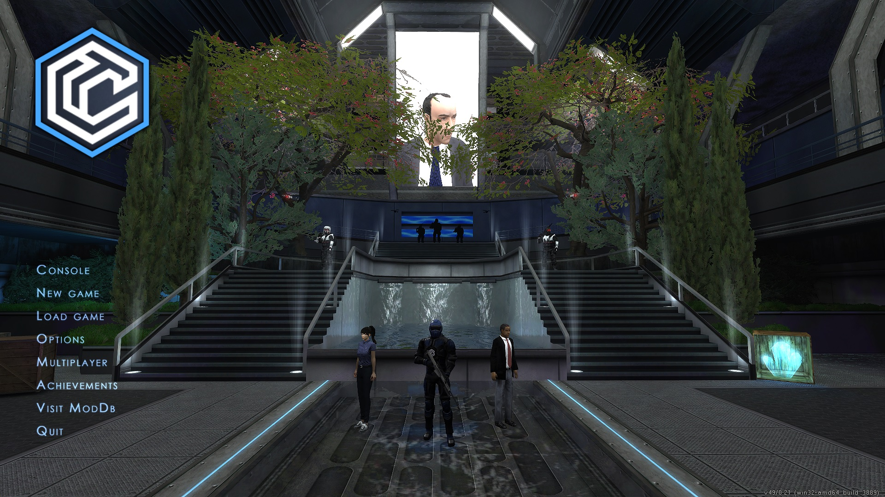
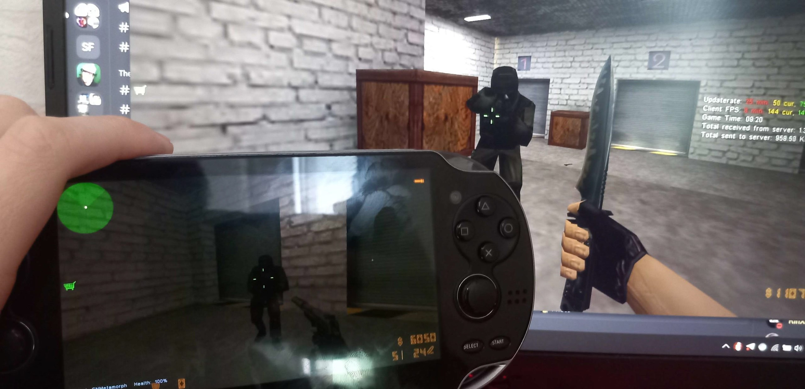
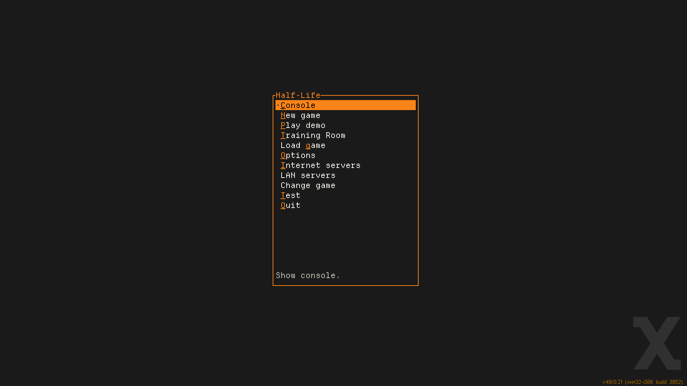
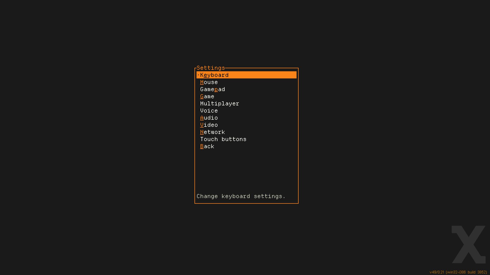
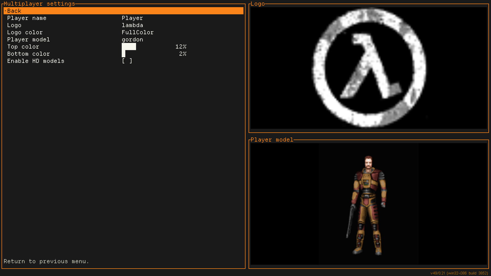
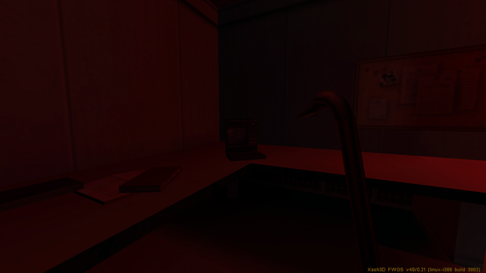
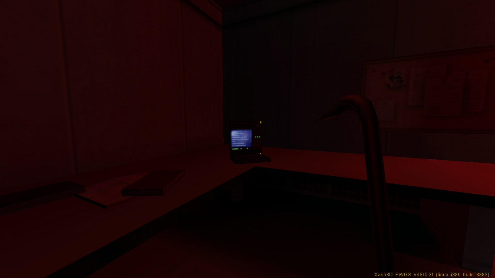
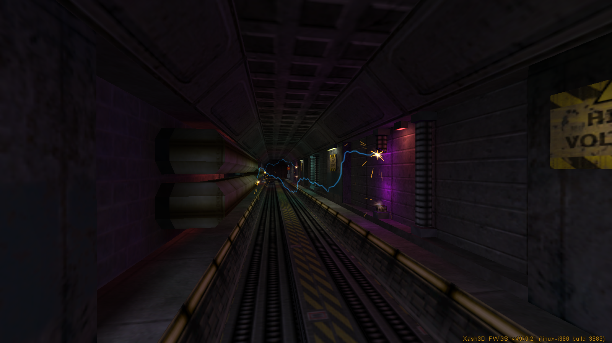
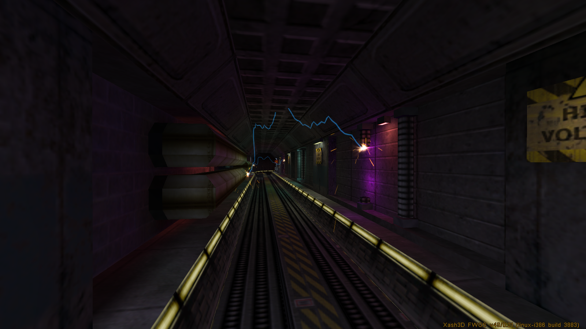

import Image from '@theme/IdealImage';
import ReactPlayer from 'react-player'

# Resume

This is a detailed overview of the changes that were made during the development of Xash3D FWGS engine in this year. I would also recommend checking out the previous development overviews that were made for [2022](https://velaron.github.io/xash3d-fwgs-november-2022.html), [2023](https://velaron.github.io/xash3d-fwgs-november-2023.html) and [2024](/posts/xash3d-fwgs-dec-2024) years.

# Consider Donating

- [**a1batross**](https://github.com/a1batross) - initial Xash3D SDL2/Linux port author, Xash3D FWGS engine maintainer, creator of non-commercial Flying With Gauss organization
  - [Boosty page](https://boosty.to/a1ba)
- [**nekonomicon**](https://github.com/nekonomicon) - maintainer of [hlsdk-portable](https://github.com/FWGS/hlsdk-portable), [mdldec](https://github.com/FWGS/xash3d-fwgs/tree/master/utils/mdldec), [opensource-mods.md](https://github.com/FWGS/xash3d-fwgs/blob/master/Documentation/opensource-mods.md) and Xash3D FWGS [contributor](https://github.com/FWGS/xash3d-fwgs/commits?author=nekonomicon) (*BSD/clang port, PNG support, etc)
  - [Boosty page](https://boosty.to/nekonomicon)
- [**Velaron**](https://github.com/Velaron) - maintainer of [cs16-client](https://github.com/Velaron/cs16-client) & [tf15-client](<https://github.com/Velaron/tf15-client>) and Xash3D FWGS [contributor](<https://github.com/FWGS/xash3d-fwgs/commits?author=Velaron>) (Android port, voice chat, etc)
  - [Buy Me A Coffee page](https://www.buymeacoffee.com/velaron)
- [**SNMetamorph**](https://github.com/SNMetamorph) - maintainer of [PrimeXT](https://github.com/SNMetamorph/PrimeXT) & [GoldSrc Monitor](https://github.com/SNMetamorph/goldsrc-monitor) and Xash3D FWGS [contributor](https://github.com/FWGS/xash3d-fwgs/commits?author=SNMetamorph) (Windows port, voice chat, etc)
  - [Boosty page](https://boosty.to/snmetamorph)
  - [Other donation methods](/donate)
- [**$_Vladislav**](https://github.com/Vladislav4KZ) - tester of Xash3D FWGS, [YaPB Project](https://github.com/yapb) member, editor of the [Official YaPB Documentation](https://github.com/yapb/docs) (in English and Russian), curator of the [YaPB Graph Database](https://github.com/yapb/graph) and author of [YaPB Waypoint/Graph Pack](https://gamebanana.com/mods/40087). Also does the Russian localization of text, images (gfx/shell), as well as additional menu buttons in English used in Xash3D FWGS for various mods.
  - [Boosty page](https://boosty.to/rasstaman1337)

## Diffusion: the first large-scale standalone game released on Xash3D FWGS
##### by [**Aynekko**](https://github.com/Aynekko)

At November 22, Diffusion mod was finally released after almost 10 year of development. This is the most large and detailed mod with unique lore and setting, and the first standalone game released on Xash3D FWGS. 

Highly recommend to check at this mod on [ModDB page](https://www.moddb.com/mods/diffusion), if you didn't yet. Also, this mod took 2nd place at [Mod of the Year 2025 Awards on ModDB](https://www.moddb.com/groups/2025-mod-of-the-year-awards/features/players-choice-mod-of-the-year-2025)! 

## PS Vita port improvements
##### by [**SNMetamorph**](https://github.com/SNMetamorph)

This year, cs16client was ported to PS Vita, attracting a lot of people attention, especially on Reddit. But just compiling it for PS Vita was not enough, to make it playable a bunch of things were changed: touch settings fine-tuned, voice chat was enabled by default, brand-new touch controls layout for PS Vita & Nintendo Switch was made, documentation for touch controls was written too.

In addition, the acquisition of a unique Console ID (CID) for the PS Vita platform has been implemented to generate a unique XashID to avoid ID collisions between different clients playing on the same platform.

<ReactPlayer 
  url={require('./vid/cs16client-vita-port.webm').default}
  width='100%'
  height='100%'
  controls
/>

## Metamod-FWGS: cross-platform Metamod-R fork
##### by [**SNMetamorph**](https://github.com/SNMetamorph)

Xash3D FWGS and most of mods (thankfully to [hlsdk-portable](https://github.com/FWGS/hlsdk-portable)) supports LP64-compatible architectures for years. But other important server-side tools such as Metamod and AMX Mod X does not support anything but x86 architecture.

Also, Metamod-R contains a lot of x86 JIT optimizations, patching hacks, constrained by binary compatibility with ReHLDS and legacy game libraries, and not flexible enough to be compatible with wide variety of compilers/toolchains and architectures. This is why we decided to do our cross-platform Metamod fork which has priority to work with Xash3D-related things in first place.

[Nodemod](https://github.com/nodemod/nodemod-goldsrc) is the first plugin that works with 64-bit Metamod, also it implements all functionality from basic AMX Mod X plugins such as administrative functions, map voting, localization, fun features and so on. It uses JavaScript and TypeScript languages for plugins, instead of Pawn, which makes possible to bring wider audience for making new plugins.

## GoldSrc voice chat support
##### by [**pwd491**](https://github.com/pwd491)

Users running Xash3D can now hear and talk to GoldSrc players, as long as those GoldSrc players are running the latest Steam version of the game. The Silk voice codec isn`t supported yet.

## GoldSrc spray customization support
##### by [**pwd491**](https://github.com/pwd491)

As for now, GoldSrc users can see sprays of Xash3D users, and this works in opposite way too. Moreover, UX are significantly improved comparing how it was in GoldSrc: you don't need to mess with `tempdecal.wad` manually anymore, just select desired image in menu and engine will automatically resize, generate transparency mask and properly generate WAD texture for you. 

## GoldSrc compatibility improvements
##### by [**Flying with Gauss**](https://github.com/FWGS)

- Disabled autogenerating gameinfo.txt ([PR #1947](https://github.com/FWGS/xash3d-fwgs/pull/1947))
- Added support for sprites with less than 256 colors in palette
- Fixed `TE_BLOODSPRITE` tempentity behaviour to match GoldSrc
- Fixed `status` client-side command behavior to match GoldSrc
- Enabled applying `texgamma` for sprites/studiomodels textures during loading
- Added support for playing/recording demos in GoldSrc format
- Added support for GoldSrc masterserver protocol

## Microsecond sleep support for some platforms
##### by [**a1batross**](https://github.com/a1batross)

Microsecond sleep makes possible to suspend game loop in time period between two game frames, instead of using busy-wait loop like in GoldSrc and vanilla Xash3D. This results in fewer CPU usage, lower temperatures & energy consumption. Instead of wasting CPU cycles inside busy-wait loop, now these cycles could be properly managed by OS scheduler and spend on useful tasks for other processes.

If you want check how this feature works on your setup, you could use `host_sleeptime_debug` console variable.

## Support for VFS mount of compressed ZIP archives
##### by [**a1batross**](https://github.com/a1batross)

Now it's possible to load files from compressed ZIP archives in same way as it was with `.pak`, `.pk3` and `.pk3dir` formats. Though, this is not preferable option, because compression makes perceivable performance overhead.

## New iOS port
##### by [**ksagameng2**](https://github.com/ksagameng2)

A new iOS port of Xash3D FWGS is now available, featuring updated platform support and improved compatibility with modern iOS devices.

## FFmpeg-based video playback
##### by [**a1batross**](https://github.com/a1batross)

Xash3D FWGS now fully supports videos playback using FFmpeg library, replacing the legacy "Video for Windows" backend. This means intro videos are no longer limited to the 32-bit Windows build and Cinepak codec, they can now be played on other platforms too. The update also adds support for the WebM videos introduced in the Half-Life 25th Anniversary Update. Supported video formats is `.mp4` with H264 codec, `.webm` with VP9 codec and `.avi` with Cinepak codec.

On Android and other non-desktop platforms FFmpeg libraries is not included in the builds by default in order to keep the engine builds lightweight.

## Support for loading maps in BSP2 format at runtime
##### by [**a1batross**](https://github.com/a1batross)

BSP2 is the different version of BSP format for maps that have expanded some data types from 16 to 32 bits, consequently expanding some of limits related to maps format. 

Back in the days, it was impossible to load BSP2 maps in runtime, because engine should be recompiled to be able to load these maps and also this was breaking compatibility with classic BSP format which was a serious concern. Now engine supports both of formats without special build options. 

## Mounting HD, Addon, Localization and Low Violence directories
##### by [**a1batross**](https://github.com/a1batross)

Now engine can load content from the folders `gamedir_hd`, `gamedir_language`, `gamedir_addon`, and `gamedir_lv`, where  **gamedir** means the name of the game directory, such as `valve`, `gearbox`, `cstrike`. For example, this feature makes possible to do proper localization of mods and standalone games, or making HD packs for existing mods. Documentation regarding to localization feature will made later, but as an example you could check how it was done in Diffusion mod.

List of cvars for mounting directories:

* `fs_mount_hd` – mounts the directory with HD models
* `fs_mount_l10n` – mounts the directory containing localization files
* `fs_mount_addon` – mounts the directory with custom content (similar to the *`custom`* folder inside the game directory)
* `fs_mount_lv` – mounts the directory with low-violence content

## Drop of legacy Xash3D FWGS protocol
##### by [**Flying with Gauss**](https://github.com/FWGS)

As of December 1, 2025, support for legacy Xash3D protocol 48 from mid-2010s era has been dropped, and players on the new engine will no longer be able to connect to servers running on the old engine. Also, servers running on deprecated protocol won't show up on public servers list anymore.

## TUI Main Menu
##### by [**numas13**](https://github.com/numas13)

A new text-based experimental menu written in Rust arrived this year. Nothing special to say here, it was made just for fun.

## Luma texture support in Half-Life
##### by [**a1batross**](https://github.com/a1batross)

Engine now supports fullbright/luma textures, identified by the `~` prefix in the texture name. This feature initially inherited from Quake, but at some point it was broken in GoldSrc and nobody noticed. But finally somebody did. 
Feature is disabled by default, but can be enabled by setting the `r_allow_wad3_luma` console variable to `1`.

## Fullscreen mode fixes
##### by [**a1batross**](https://github.com/a1batross)

In recent engine updates, several issues related to fullscreen mode have been fixed. Previously, when users enabled fullscreen, the game could actually remain in a window or start with an incorrect screen resolution. This issue was fixed in commit [`4a16ca8`](https://github.com/FWGS/xash3d-fwgs/commit/4a16ca8).  

Another issue caused the engine to get confused about the window state when exiting fullscreen. After switching to windowed mode, the window could have an incorrect size or behave as if it was still maximized. This was fixed in commit [`ad01be8`](https://github.com/FWGS/xash3d-fwgs/commit/ad01be8).

## Other minor changes & bug fixes
##### by [**Flying with Gauss**](https://github.com/FWGS)

- Fixed incorrect XashID generation on Windows due to uninitialized string
- Improved compatibility with GoldSrc-based clients behavior (thanks [**@Garey27**](https://github.com/Garey27))
- Fixed loading of DDS with volume textures
- Attempt to automatically create .nomedia file in directory where games are located on Android
- Fixed erasing physinfo on client connect, when it was already set by game logic on save restore
- Fixed SQB in event playback function
- Fixed crash if server sends new movevars before entities were created
- Fixed command line window popping on Windows when starting engine
- Fixed mitigations of speedhack and other input commands spoofing hacks
- Fixed some of exploits that were made possible to crash servers
- Fixed bug when engine couldn't start on Windows in case if file path contains non-latin symbols
- Fixed restoring player view entity after save restore (fixes trigger_camera usage)
